# G-Shield Code — Architecture

> **Version:** 0.2.0
> **Last updated:** 2026-03-28
> **Author:** Gabriel Chávez

---

## Table of Contents

1. [Overview](#1-overview)
2. [Repository Structure](#2-repository-structure)
3. [System Diagram](#3-system-diagram)
4. [Backend Architecture](#4-backend-architecture)
   - 4.1 [Modular Structure](#41-modular-structure)
   - 4.2 [Module Anatomy](#42-module-anatomy)
   - 4.3 [Layer Responsibilities](#43-layer-responsibilities)
   - 4.4 [Layer Communication Rules](#44-layer-communication-rules)
   - 4.5 [Shared Kernel](#45-shared-kernel)
   - 4.6 [Authentication & Middleware](#46-authentication--middleware)
   - 4.7 [Real-time Layer](#47-real-time-layer)
5. [Design Patterns](#5-design-patterns)
   - 5.1 [Repository Pattern](#51-repository-pattern)
   - 5.2 [Service Pattern](#52-service-pattern)
   - 5.3 [Strategy Pattern](#53-strategy-pattern)
   - 5.4 [Result Pattern](#54-result-pattern)
   - 5.5 [Patterns Working Together](#55-patterns-working-together)
6. [Frontend Architecture](#6-frontend-architecture)
7. [Data Flow — Code Submission](#7-data-flow--code-submission)
8. [Error Handling Strategy](#8-error-handling-strategy)
9. [Tech Stack Reference](#9-tech-stack-reference)

---

## 1. Overview

**G-Shield Code** is a **modular monolith** full-stack platform for the secure
evaluation of untrusted code in isolated Docker sandboxes. The system is
structured as a **pnpm monorepo** with two applications (`@app/frontend`,
`@app/backend`) that share TypeScript configuration and tooling.

The backend is divided into **self-contained feature modules** (`auth`,
`problem`, `submission`). Each module owns all of its layers co-located in a
single folder, following a consistent `{module}.{layer}.ts` naming convention.
Cross-module communication happens exclusively through each module's public
`index.ts` — never by importing internal layer files from another module.

---

## 2. Repository Structure

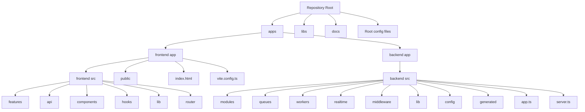

---

## 3. System Diagram

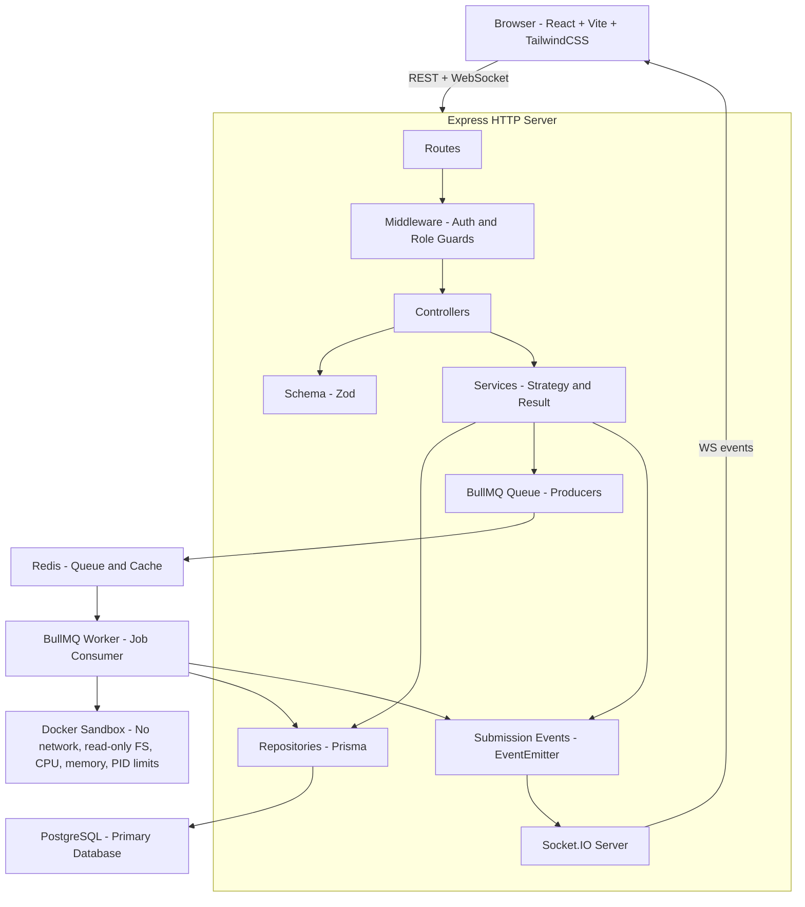

---

## 4. Backend Architecture

### 4.1 Modular Structure

The backend is organised around **feature modules**. Each module is a
self-contained vertical slice — it owns its routes, controller, schema,
service, repository, and optional strategies. No layer file from one module
may be imported directly by another module.

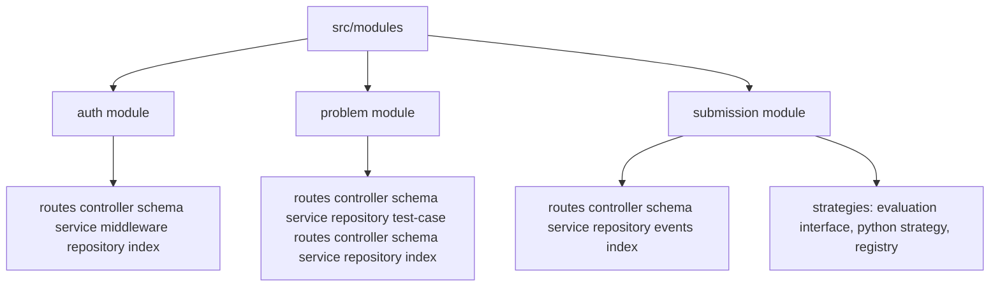

### 4.2 Module Anatomy

Every module follows the same internal file structure and naming convention.
All layers are **co-located** — there are no global `controllers/`,
`services/`, or `repositories/` folders.

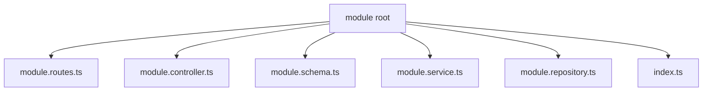

**Naming convention:** `{module}.{layer}.ts`

| File                 | Layer      |
| -------------------- | ---------- |
| `auth.routes.ts`     | Route      |
| `auth.controller.ts` | Controller |
| `auth.schema.ts`     | Schema     |
| `auth.service.ts`    | Service    |
| `auth.repository.ts` | Repository |

> **Module boundary rule:** If module `A` needs something from module `B`,
> it imports **only** from `B/index.ts`. Reaching directly into
> `B/b.service.ts` or `B/b.repository.ts` is forbidden.

### 4.3 Layer Responsibilities

| Layer            | File                       | Responsibility                                                                                                                                           |
| ---------------- | -------------------------- | -------------------------------------------------------------------------------------------------------------------------------------------------------- |
| **Route**        | `{module}.routes.ts`       | Register URL path + HTTP verb. Attach middleware (authenticate, requireRole) and controller methods. Zero business logic.                                |
| **Controller**   | `{module}.controller.ts`   | Parse the request via the schema layer. Delegate to the service. Map the `Result` to an HTTP response using `result.isError()` / `result.unwrap()`.      |
| **Schema**       | `{module}.schema.ts`       | Declare all Zod schemas for this module. Export inferred DTO types. Single source of truth for all input shapes. Errors formatted with `z.treeifyError`. |
| **Service**      | `{module}.service.ts`      | Orchestrate business rules. Select and invoke strategies. Coordinate repositories and event emitters. Return a typed `Result<T, E>`.                     |
| **Repository**   | `{module}.repository.ts`   | All and only Prisma interactions for this module's aggregate. Exposes a typed `I{Module}Repository` interface.                                           |
| **Strategy**     | `strategies/*.strategy.ts` | One pluggable algorithm implementation per language variant. Implements a shared `IEvaluationStrategy` interface.                                        |
| **Events**       | `{module}.events.ts`       | Typed `EventEmitter` subclass for intra-process async signalling (e.g. `SubmissionEvents`). Decouples the service layer from Socket.IO.                  |
| **Module index** | `index.ts`                 | Instantiates repositories, services, controllers, and routers. Re-exports the public surface (router, service, public types). Hides all internals.       |

### 4.4 Layer Communication Rules

Inside a module, the permitted call direction is strictly top-down:

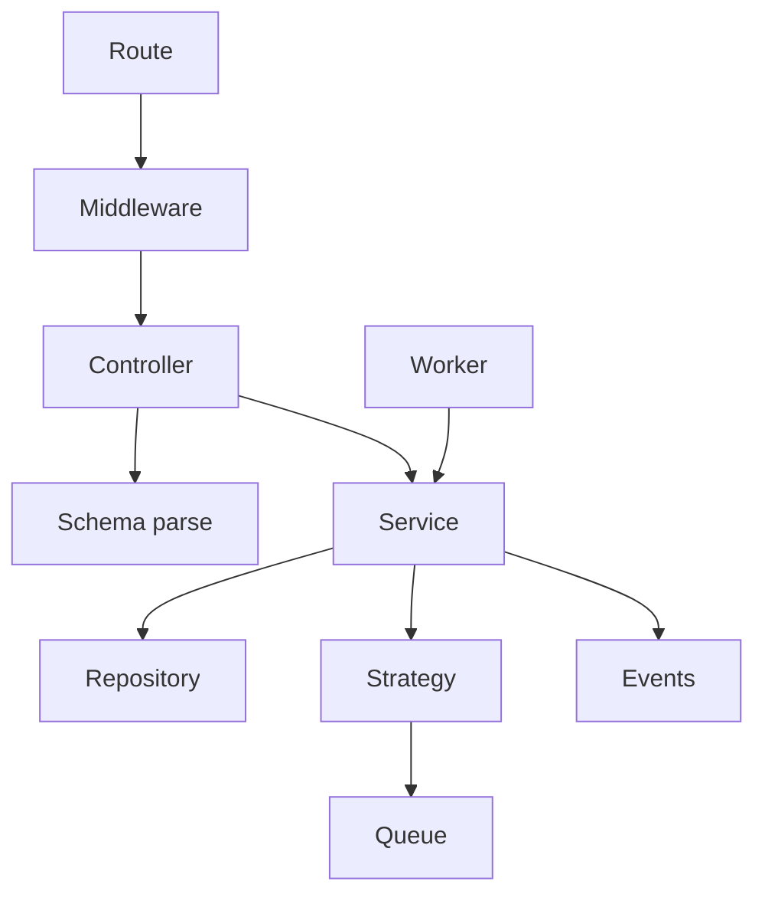

| From       | May call                            | Must NOT call                           |
| ---------- | ----------------------------------- | --------------------------------------- |
| Route      | Middleware, Controller              | Service, Schema, Repository, Strategy   |
| Controller | Service, Schema (safeParse)         | Repository, Queue directly              |
| Service    | Repository, Strategy, Queue, Events | Controller, Schema                      |
| Repository | Prisma client only                  | Service, Controller, Schema, Strategy   |
| Worker     | Service                             | Controller                              |
| Strategy   | Queue (via injected producer)       | Service, Controller, Schema, Repository |

> **Schema is a one-way door.** It is called by the controller to parse
> incoming data before the service is ever invoked. The service only ever
> receives already-typed DTOs — it never re-validates.

### 4.5 Shared Kernel

Code that is genuinely shared across modules lives in `src/lib/`,
`src/config/`, `src/queues/`, `src/workers/`, `src/realtime/`, and
`src/middleware/`. These are infrastructure primitives with no business logic.

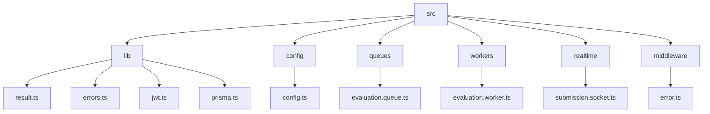

**Rules for the shared kernel:**

- `lib/` files may be imported by any layer in any module.
- `config/` is imported only by `lib/` files, `app.ts`, and `server.ts` —
  never directly inside a module's business logic.
- `realtime/` listens to `SubmissionEvents` and forwards them to connected
  WebSocket clients — it must not call module internals directly.
- Modules must **not** add domain logic to any shared kernel folder.

### 4.6 Authentication & Middleware

Authentication is handled entirely inside `src/modules/auth/auth.middleware.ts`
and exported through `auth/index.ts` as reusable Express middleware.

```typescript
// Exported from auth/index.ts — used by all protected routes
export const authenticate = createAuthenticateMiddleware(); // verifies JWT Bearer
export { isAuthenticated }; // type-guard: Request → AuthenticatedRequest
export { requireRole }; // factory: (...roles: UserRole[]) => RequestHandler
```

**Flow inside a protected controller:**

```typescript
// 1. Route applies middleware
router.post('/', authenticate, requireRole(UserRole.CODER), (req, res) =>
  controller.create(req, res)
);

// 2. Controller narrows the request type
if (!isAuthenticated(req)) {
  res.status(401).json({ error: 'Authentication required' });
  return;
}
// req.user is now { id, email, role }
```

**JWT utilities** (`src/lib/jwt.ts`):

| Function             | Purpose                               |
| -------------------- | ------------------------------------- |
| `signAccessToken`    | Signs a short-lived access JWT        |
| `signRefreshToken`   | Signs a long-lived refresh JWT        |
| `verifyAccessToken`  | Validates and decodes an access token |
| `verifyRefreshToken` | Validates and decodes a refresh token |

Refresh tokens are persisted in the `refresh_tokens` table and validated
against the DB on every `/refresh-token` request. Token reuse triggers
deletion of all user sessions (refresh token rotation).

### 4.7 Real-time Layer

Real-time submission updates flow through a three-layer decoupled pipeline:

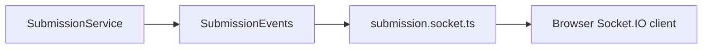

`SubmissionEvents` (`src/modules/submission/submission.events.ts`) is a typed
`EventEmitter` subclass. It emits `SubmissionLifecycleEvent` discriminated
unions of four types:

| Event type | When emitted                                         |
| ---------- | ---------------------------------------------------- |
| `queued`   | After the job is enqueued and `queueJobId` is stored |
| `status`   | Whenever `updateStatus` is called on a submission    |
| `result`   | After each individual test-case result is persisted  |
| `progress` | After each test case, carrying `completed / total`   |

The Socket.IO server (`src/realtime/submission.socket.ts`) authenticates
connections via the access token in `socket.handshake.auth.token`, verifies
ownership before allowing room joins, and forwards lifecycle events to the
appropriate submission room.

---

## 5. Design Patterns

### 5.1 Repository Pattern

**Purpose:** Decouple business logic from the persistence layer. The service
layer never imports Prisma directly — it depends only on a repository
interface defined in the same module file. This makes the implementation
trivially swappable (e.g. for tests using an in-memory fake).

**Structure:**

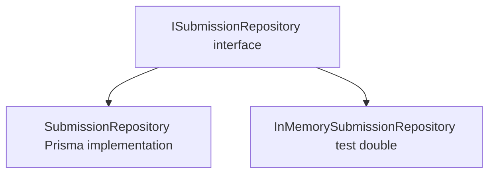

**Example:**

```typescript
// src/modules/submission/submission.repository.ts

export interface ISubmissionRepository {
  findAll(filters?: { userId?: string; problemId?: string }): Promise<Submission[]>;
  findById(id: string): Promise<SubmissionWithResults | null>;
  findByIdWithContext(id: string): Promise<SubmissionWithContext | null>;
  create(data: Prisma.SubmissionUncheckedCreateInput): Promise<Submission>;
  updateStatus(id: string, status: SubmissionStatus): Promise<Submission>;
  setQueueJobId(id: string, queueJobId: string): Promise<Submission>;
  addResult(data: Prisma.SubmissionResultUncheckedCreateInput): Promise<SubmissionResult>;
}

export class SubmissionRepository implements ISubmissionRepository {
  constructor(private readonly db: PrismaClient) {}

  async findById(id: string): Promise<SubmissionWithResults | null> {
    return this.db.submission.findUnique({
      where: { id },
      include: {
        problem: true,
        submissionResults: { include: { testCase: true }, orderBy: { createdAt: 'asc' } },
      },
    });
  }

  async addResult(data: Prisma.SubmissionResultUncheckedCreateInput): Promise<SubmissionResult> {
    return this.db.submissionResult.create({ data });
  }
  // … other methods
}
```

> **Rule:** Repository methods are named after **what they do**, not how they
> do it — `findById`, not `prismaFindUnique`. Prisma-specific types (e.g.
> `Prisma.SubmissionGetPayload`) are confined to the repository file.

---

### 5.2 Service Pattern

**Purpose:** Centralise all business logic in a single, testable class.
Services receive all dependencies (repositories, strategy registry, event
emitter) via constructor injection — making them unit-testable without a real
database or Docker daemon.

```typescript
// src/modules/submission/submission.service.ts

export class SubmissionService {
  constructor(
    private readonly submissionRepo: ISubmissionRepository,
    private readonly strategyRegistry: IEvaluationStrategyRegistry
  ) {}

  async create(
    dto: CreateSubmissionDto,
    userId: string
  ): Promise<Result<Submission, UnsupportedLanguageError>> {
    const strategy = this.strategyRegistry.get(dto.language as ProgramingLanguage);

    if (!strategy) {
      return Result.error(new UnsupportedLanguageError(dto.language));
    }

    const submission = await this.submissionRepo.create({ ...dto, userId });
    const jobId = await strategy.enqueue(submission);
    const queued = await this.submissionRepo.setQueueJobId(submission.id, jobId);

    submissionEvents.emitLifecycle({
      type: 'queued',
      submissionId: queued.id,
      userId: queued.userId,
      language: queued.language,
      queueJobId: jobId,
    });

    return Result.ok(queued);
  }
}
```

---

### 5.3 Strategy Pattern

**Purpose:** Encapsulate each language's evaluation logic behind a shared
`IEvaluationStrategy` interface. The service never contains
`if language === 'python'` branches. Adding a new language = one new class.

**Structure:**

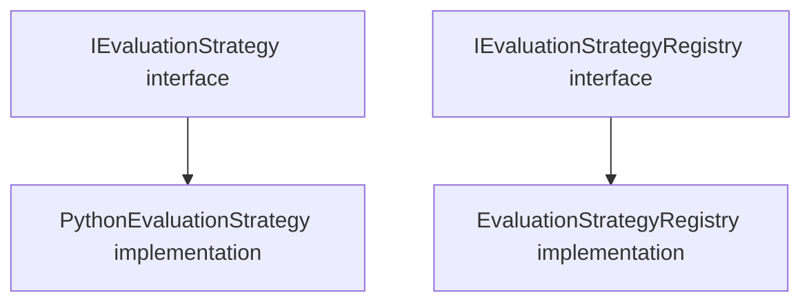

**Interface:**

```typescript
// src/modules/submission/strategies/evaluation.strategy.ts

export interface TestCaseInput {
  id: string;
  input: string;
  expectedOutput: string;
}

export interface TestCaseResult {
  testCaseId: string;
  status: SubmissionStatus;
  actualOutput: string | null;
  executionTimeMs: number | null;
  memoryUsageMb: number | null;
}

export interface EvaluationExecutionHooks {
  onTestCaseResult?: (result: TestCaseResult, index: number, total: number) => Promise<void> | void;
}

export interface SubmissionExcecutionContext {
  submissionId: string;
  sourceCode: string;
  language: ProgramingLanguage;
  timeLimitMs: number;
  memoryLimitMb: number;
  testCases: TestCaseInput[];
}

export interface IEvaluationStrategy {
  readonly language: ProgramingLanguage;
  enqueue(submission: Submission): Promise<string>; // returns jobId
  execute(
    context: SubmissionExcecutionContext,
    hooks?: EvaluationExecutionHooks
  ): Promise<TestCaseResult[]>;
}
```

**Registry:**

```typescript
// src/modules/submission/strategies/index.ts

export class EvaluationStrategyRegistry implements IEvaluationStrategyRegistry {
  private readonly strategies = new Map<ProgramingLanguage, IEvaluationStrategy>();

  register(strategy: IEvaluationStrategy): void {
    this.strategies.set(strategy.language, strategy);
  }

  get(language: ProgramingLanguage): IEvaluationStrategy | undefined {
    return this.strategies.get(language);
  }
}
```

**Registration (at module init in `submission/index.ts`):**

```typescript
export const strategyRegistry = new EvaluationStrategyRegistry();
strategyRegistry.register(new PythonEvaluationStrategy(evaluationQueue));
// strategyRegistry.register(new JavaScriptEvaluationStrategy(evaluationQueue));
```

> **Adding a new language** = write one new class + one `strategyRegistry.register()`
> call. No existing code changes. Open/Closed Principle in practice.

**Docker sandbox constraints (PythonEvaluationStrategy):**

| Constraint       | Value              |
| ---------------- | ------------------ |
| Image            | `python:3.12-slim` |
| Network          | Disabled           |
| Memory           | `memoryLimitMb` MB |
| Memory swap      | Same as memory     |
| CPU              | 0.5 vCPU           |
| PID limit        | 64                 |
| Capabilities     | All dropped        |
| Filesystem mount | Read-only (`ro`)   |
| Timeout          | `timeLimitMs` ms   |

---

### 5.4 Result Pattern

**Purpose:** Make failure explicit at the type level. Services return
`Result<T, E>` instead of throwing for expected domain errors. Controllers
handle both branches explicitly — no silent failures.

**Core class:**

```typescript
// src/lib/result.ts

export class Result<T, E = Error> {
  private constructor(
    private readonly _success: boolean,
    private readonly _value?: T,
    private readonly _error?: E
  ) {}

  static ok<T, E = Error>(value: T): Result<T, E> {
    return new Result<T, E>(true, value);
  }

  static error<T, E = Error>(error: E): Result<T, E> {
    return new Result<T, E>(false, undefined, error);
  }

  isOk(): boolean {
    return this._success;
  }
  isError(): boolean {
    return !this._success;
  }

  unwrap(): T {
    if (this._success) return this._value as T;
    if (this._error instanceof Error) throw this._error;
    throw new Error(String(this._error));
  }

  unwrapOr(fallback: T): T {
    return this._success ? (this._value as T) : fallback;
  }

  map<U>(fn: (value: T) => U): Result<U, E> {
    /* … */
  }
  mapError<F>(fn: (error: E) => F): Result<T, F> {
    /* … */
  }
  flatMap<U>(fn: (value: T) => Result<U, E>): Result<U, E> {
    /* … */
  }

  getValue(): T | undefined {
    /* … */
  }

  // Overloaded — narrows to E when called on Result<never, E>
  getError(): E | undefined;
}
```

> **Important:** The Result implementation is a **class**, not a discriminated
> union. Use `result.isError()` / `result.isOk()` (not `isErr` / `isOk`
> helper functions — those do not exist in this codebase).

**Domain error classes (`src/lib/errors.ts`):**

```typescript
// Base class — carries statusCode and code for the error middleware
export class AppError extends Error {
  constructor(
    public readonly message: string,
    public readonly statusCode: number,
    public readonly code: string
  ) {
    super(message);
  }
}

// Domain errors — used inside Result<T, E>; mapped to HTTP codes in controllers
export class NotFoundError extends Error {
  readonly code = 'NOT_FOUND';
}
export class UnauthorizedError extends Error {
  readonly code = 'UNAUTHORIZED';
}
export class ConflictError extends Error {
  readonly code = 'CONFLICT';
}
export class InvalidCredentialsError extends Error {
  readonly code = 'INVALID_CREDENTIALS';
}
export class ForbiddenError extends Error {
  readonly code = 'FORBIDDEN';
}
export class UnsupportedLanguageError extends Error {
  readonly code = 'UNSUPPORTED_LANGUAGE';
}
```

**Controller pattern (unwrapping Results):**

```typescript
const result = await this.submissionService.create(parsed.data, req.user.id);

if (result.isError()) {
  const error = result.getError();
  if (error instanceof UnsupportedLanguageError) {
    res.status(422).json({ error: error.message });
    return;
  }
  res.status(500).json({ error: 'An unexpected error occurred' });
  return;
}

res.status(202).json({ data: result.unwrap() });
```

---

### 5.5 Patterns Working Together

The following shows a complete request cycle for `POST /api/submissions`.

**Schema layer** — single source of truth for all input shapes:

```typescript
// src/modules/submission/submission.schema.ts

import { z } from 'zod';

const languagesEnum = z.enum(['PYTHON']);

export const createSubmissionSchema = z.object({
  sourceCode: z.string().trim().min(1).max(50000),
  language: languagesEnum,
  problemId: z.uuid(),
});

export type CreateSubmissionDto = z.infer<typeof createSubmissionSchema>;
```

**Controller** — parses via the schema layer, delegates to service, unwraps Result:

```typescript
// src/modules/submission/submission.controller.ts

async create(req: Request, res: Response): Promise<void> {
  if (!isAuthenticated(req)) {
    res.status(401).json({ error: 'Authentication required' });
    return;
  }

  // 1. Schema layer parses and types the raw request body
  const parsed = createSubmissionSchema.safeParse(req.body);
  if (!parsed.success) {
    res.status(400).json({ error: z.treeifyError(parsed.error) });
    return;
  }

  // 2. Delegate — controller has zero business logic
  const result = await this.submissionService.create(parsed.data, req.user.id);

  // 3. Unwrap — both branches are explicitly handled
  if (result.isError()) {
    const error = result.getError();
    if (error instanceof UnsupportedLanguageError) {
      res.status(422).json({ error: error.message });
      return;
    }
    res.status(500).json({ error: 'An unexpected error occurred' });
    return;
  }

  res.status(202).json({ data: result.unwrap() });
}
```

**Data flow summary:**

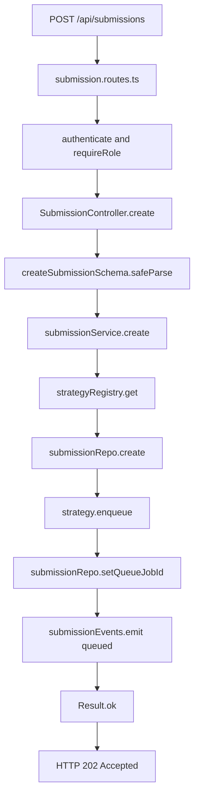

---

## 6. Frontend Architecture

```mermaid
flowchart TB
  fe_src_root["frontend src"]

  fe_src_root --> features["features"]
  fe_src_root --> api_group["api"]
  fe_src_root --> components_group["components"]
  fe_src_root --> hooks_group["hooks"]
  fe_src_root --> lib_group_fe["lib"]
  fe_src_root --> router_group["router"]
  fe_src_root --> main_file["main.tsx"]

  features --> feature_auth["auth"]
  features --> feature_dashboard["dashboard"]
  features --> feature_problems["problems"]
  features --> feature_submissions["submissions"]

  api_group --> api_index["index.ts"]
  api_group --> api_auth["auth.api.ts"]
  api_group --> api_problems["problems.api.ts"]
  api_group --> api_submissions["submissions.api.ts"]
  api_group --> api_test_cases["test-cases.api.ts"]

  components_group --> ui_group["ui"]
  components_group --> layout_group["layout"]

  lib_group_fe --> axios_file["axios.ts"]
  lib_group_fe --> token_store_file["tokenStore.ts"]
  lib_group_fe --> utils_file["utils.ts"]

  router_group --> router_index["index.tsx"]
  router_group --> route_error["RouteErrorPage.tsx"]
  router_group --> route_fallback["RouteHydrateFallback.tsx"]
  router_group --> router_layouts["layouts"]
  router_group --> router_loaders["loaders"]
```

**Rules:**

- All `fetch` / `axios` calls live **only** inside `src/api/`. Components and
  hooks never call the network directly.
- Feature folders export a public interface via `index.ts`. Cross-feature
  imports must go through this boundary.
- The access token lives entirely in memory (`tokenStore.ts`) — never in
  `localStorage`. `initAuth()` silently attempts a token refresh on first load.
- The Axios instance (`lib/axios.ts`) automatically attaches the `Authorization`
  header and handles 401 responses by attempting a single refresh, then
  dispatching an `auth:logout` custom event on failure.
- Role-based route guards are implemented as React Router loaders via
  `createRoleLoader(allowedRoles)`. This runs server-side before the component
  mounts, redirecting unauthenticated or unauthorised users.
- Real-time submission status is received via `socket.io-client`. The
  `SubmissionDetailPage` subscribes to the relevant room on mount and
  unsubscribes on unmount.

---

## 7. Data Flow — Code Submission

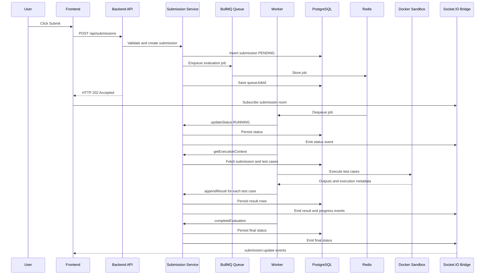

---

## 8. Error Handling Strategy

### Domain errors (travel as `Result<T, E>` values)

| Error origin             | Type                       | HTTP status | Handled by                    |
| ------------------------ | -------------------------- | ----------- | ----------------------------- |
| Invalid request body     | `ZodError`                 | 400         | Controller — `z.treeifyError` |
| Wrong credentials        | `InvalidCredentialsError`  | 401         | Controller                    |
| Unauthenticated request  | `UnauthorizedError`        | 401         | Controller / middleware       |
| Access denied            | `ForbiddenError`           | 403         | Controller / `requireRole`    |
| Resource not found       | `NotFoundError`            | 404         | Controller                    |
| Email already registered | `ConflictError`            | 409         | Controller                    |
| Unsupported language     | `UnsupportedLanguageError` | 422         | Controller                    |

### Infrastructure errors (thrown and caught globally)

| Error origin            | Type                    | Handled by                                        |
| ----------------------- | ----------------------- | ------------------------------------------------- |
| Unexpected server error | `Error`                 | `middleware/error.ts` — 500                       |
| Sandbox CPU timeout     | kill SIGKILL via worker | Worker — marks submission `TIME_LIMIT_EXCEEDED`   |
| Sandbox OOM             | Docker OOMKilled flag   | Worker — marks submission `MEMORY_LIMIT_EXCEEDED` |
| Sandbox non-zero exit   | exitCode check          | Worker — marks submission `RUNTIME_ERROR`         |
| Python syntax error     | stderr check            | Worker — marks submission `COMPILATION_ERROR`     |

**Global error handler (`src/middleware/error.ts`):**

```typescript
export const errorHandler: ErrorRequestHandler = (error, _req, res, _next) => {
  const appError = normalizeError(error); // maps known errors to AppError
  const isServerError = appError.statusCode >= 500;

  res.status(appError.statusCode).json({
    error:
      isServerError && config.nodeEnv === 'production'
        ? 'An unexpected error occurred. Please try again later.'
        : appError.message,
    code: appError.code,
    ...(config.nodeEnv === 'development' ? { stack: appError.stack } : {}),
  });
};
```

> **Principle:** Expected domain errors travel as `Result<T, E>` values —
> they are **data**, not exceptions. Only truly unexpected infrastructure
> failures are thrown and caught by the global handler. The `stack` field is
> only included in `development` mode.

---

## 9. Tech Stack Reference

| Concern            | Technology              | Rationale                                                              |
| ------------------ | ----------------------- | ---------------------------------------------------------------------- |
| Frontend framework | React 19 + Vite 8       | Component model + fast HMR + rolldown bundler                          |
| Styling            | TailwindCSS 4           | Utility-first, no CSS drift                                            |
| UI components      | shadcn/ui (radix-vega)  | Accessible primitives, fully owned in `components/ui/`                 |
| Backend framework  | Express 5               | Minimal, well-understood, async-friendly                               |
| Language           | TypeScript 5.9 (strict) | Type safety across all layers; `erasableSyntaxOnly` mode               |
| ORM                | Prisma 7 + PrismaPg     | Type-safe DB access, declarative migrations, PostgreSQL adapter        |
| Validation         | Zod 4                   | Schema-first, inferred DTOs — co-located in each module's `.schema.ts` |
| Primary database   | PostgreSQL 18           | ACID compliance, relational model                                      |
| Job queue          | Redis + BullMQ 5        | Reliable async job processing with concurrency control                 |
| Real-time          | Socket.IO 4             | Bidirectional events for per-submission status streaming               |
| Sandbox            | Docker + Dockerode      | OS-level isolation with resource limits                                |
| Authentication     | JWT (jsonwebtoken)      | Short-lived access token + long-lived refresh token (httpOnly cookie)  |
| Package manager    | pnpm 10 + workspaces    | Fast installs, strict dependency isolation                             |
| Testing            | Jest + Playwright       | Unit/integration + E2E coverage                                        |
